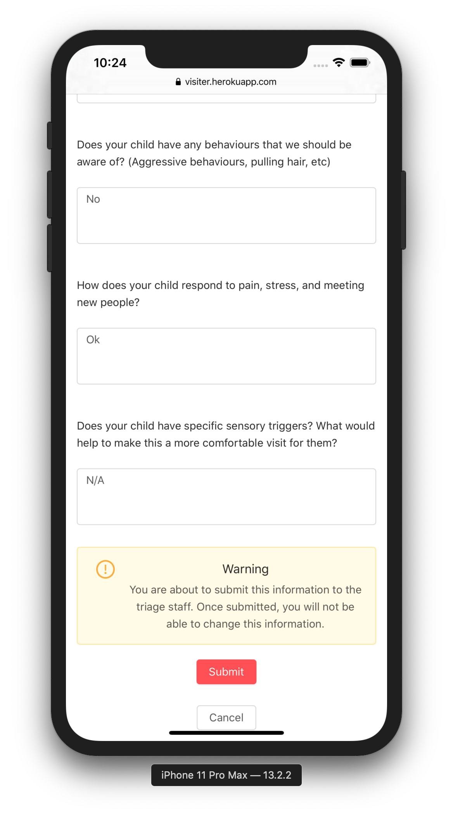

# VisitER

Deployed at: https://visiter.herokuapp.com/

VisitER is an online emergency-room (ER) check-in system. It is specifically developed for parents and caregivers of autistic children, so that when a child needs to visit the ER, their caregiver can initiate the triage process from the comfort of their own home. This is preferable to waiting for hours in the ER, where the chaotic environment may be overstimulating for the child. Once patient and case details have been submitted, the triage staff will assign a wait time, which is then returned to the caregiver, informing them of when they should arrive at the hospital in order to see a physician with minimal waiting.

Created fall 2019 for the [Innovation 4 Health](https://www.innovation4health.com/) 2019 Health Hack Competition (Group 1).

This project was started using the [React + Rails Boilerplate](https://github.com/NimaBoscarino/react-rails-boilerplate) from Nima Boscarino. This is the single repository required for this project, though two terminals are required to run the app locally, as explained below.

# Screenshots

The VisitER online check-in process works according to these steps:

## 1. Sign-on by caregiver of child patient (mobile-friendly)

## 2. Tap New ER Visit button in red

## 3A. Enter patient details

## 3B. Submit patient details

## 4A. Answer triage questions

## 4B. Submit triage questions

## 5. Hospital triage staff receives new visit request

## 6. Hospital triage staff reviews case details

## 7. Hospital triage staff assigns wait time

## 8. Caregiver notified of assigned wait time

# Installation

See complete details at the [React + Rails Boilerplate](https://github.com/NimaBoscarino/react-rails-boilerplate) repository.

## Dependencies

* Ruby on Rails >= 5.2.2.1
* PostgreSQL
* NodeJS

## Running the app

You need **TWO** terminals for this.

1. Clone this repository.

2. In one terminal, run `bundle` to install the dependencies. Run `bin/rake db:setup` to create the databases (called visit_er_development by default). Run `bin/rails s` to run the server.

3. In the other terminal, `cd` into `client`. Run `npm install`. Rename the `.env.example` file to be called `.env` and add `REACT_APP_SECRET_WS_URL=ws://localhost:3001/cable`. Then run `npm start` and go to `localhost:3000` in your browser.

# Contributing

Please follow this procedure to add your code to the repository via a pull request:

1. When working on a new feature or bugfix, checkout the repo to your local machine first: `git clone git@github.com:hitony7/WaitTimes.git` then `cd` into the `WaitTimes` folder. If you already have a local version, be sure to run `git pull` when on your local master branch to receive the latest updates from the remote master branch.

2. Install dependencies as above in Installation if you haven't already.

3. Create a new local branch: `git checkout -b feature/<new-feature-name>` (`-b` option creates a new branch).

4. Commit working changes to your local branch as you implement features/fixes. Commit often as long as things are working. These changes are saved locally only so far (not yet remotely).

5. Once your feature/fix is complete (with one or more commits), push it to a new remote branch: `git push -u origin feature/<new-feature-name>`

6. Submit a pull request on Github for your remote branch to be merged into the remote master branch with Russell (@rmcwhae) as the reviewer. Russell will review and merge the branch.

7. Before working on a new branch, always switch back to your local master branch: `git checkout master` and `git pull` to grab the latest remote changes.

# Coding Updates

## November 27, 2019 11:00 AM

Current to-do list:

1. ~~Implement user registration system. This will involve creating a form in React and then submitting that data to an end-point in Rails where Active Record calls will ultimately update the database.~~

2. ~~Seed database with data for a few sample "ER Visits"~~

3. ~~Implement form for client-side "ER Visit" initiation based on questions grabbed from database.~~

4. ~~Implement triage-nurse admin panel to see incoming ER Visits and assign a wait time.~~

5. Use websockets to live-update assigned wait time for client from triage nurse. *Works, but buggy*

6. CTAS score and Likert scale assignment algorithm.

7. ~~Polishing: add patient allergies, gender, and caregiver relationship to patient~~

8. Optional: add hospital selector based on geolocation

9. Polishing: add input debouncing for triage question form elements.

10. Add testing via rspec

## November 20, 2019 9:30 PM

Caregivers can now initialize ER visits for their child, which are stored in the database. Don't forget to run `rails db:migrate` in `WaitTimes` to migrate your local database after running `git pull`.

## November 19, 2019 2:30 PM

User registration system works!

## November 18, 2019

Roles implemented on front-end. Signing in as `bob@smith.com` or `jackie@ahs.com` (both `password`) gives a different screen (new ER event or triage admin panel, depending on role).

## November 12, 2019

Basic user login system works. Try logging in with `bob@smith.com` and `password`. To get the latest changes, `cd` into `WaitTimes` and `git pull`. In `WaitTimes` run `bundle` to install the latest dependencies, then `rake db:setup` to reset and seed the database (you may need to run `sudo service postgresql start` first), then `bin/rails s` to start the Rails API server. In `WaitTimes\client` run `npm install` to install the latest dependencies, then `npm start` to start the React front-end. As always, don't code on master; see step 3 of 'Pull Requests' below.

To-do list (for Minimum Viable product; not comprehensive):

1. Implement user registration system. This will involve creating a form in React and then submitting that data to an end-point in Rails where Active Record calls will ultimately update the database.

2. Seed database with data for a few sample "ER Visits"

3. Implement form for client-side "ER Visit" initiation based on questions grabbed from database.

4. Implement triage-nurse admin panel to see incoming ER Visits and assign a wait time.

5. Use websockets to live-update assigned wait time for client from triage nurse.

6. CTAS score and Likert scale assignment algorithm.